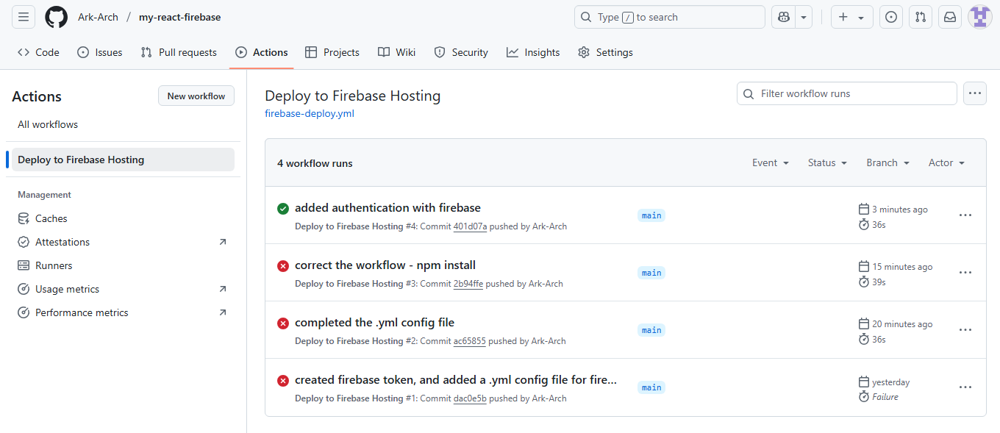

# APPLYING DEVOPs SKILLS ON THE REACT-VITE STARTER APPLICATION
With this repository, I describe my journey l

## FIRST TASK: CONFIGURE AND DEPLOY THE APPLICATION USING FIREBASE
1. `firebase login`
    1. if firebase command not recognised, then install firebase
        1. `npm install -g firebase-tools` (-g) makes the installation global.
2. `firebase login` should work now.
    1. if successfully logged in, then move on to the next
3. initiallize firebase in the project, select hosting, and what the public directory would be using `firebase init` 
    it was important i make a choice of firebase hosting instead of firebase app hosting, since my application is a pure react app (front-end app) that does not include any backend service

4. build the app, using 
    1. `npm run build`
5. deploy using `firebase deploy`

### RESULTS:
the hosting URL of the deployed application
https://react-firebase-b1434.web.app/ 

## SECOND TASK: SET UP A CI/CD PIPELINE USING GIHUB ACTIONS FOR DEPLOYMENT AUTOMATION
1. generate a firebase CI token (this token should be kept safe)
    
    `firebase login:ci` or `firebase login:ci --no-localhost` if the other fails
    
    the CI token is a **continous integration** token. it is an authentication token that allows automated systems (like github actions) to deploy the application to firebase **without requiring manual login!** 
    
    **continuous integration** simply ensures that the application builds successfully without any test failures before deployment
    
2. add the token to GitHub secrets.
    
    project github repo > settings > secrets and variables > actions ⇒ create a new repo secret and add the firebase ci token
    
3. create github actions workflow file
    
    the file should be created at /.github/workflows/firebase-deploy.yml
    
    .yml files are simply human-readable data format often used for configuration files, data serialization, and interaction with APIs.
    
    **what happens with the github .yml workflow file**
    
    It is made up of 3 essential items: **Events, Jobs and steps**
    
    - EVENTS → this is the trigger event for example code push, or pull request
    - JOB → this is the tasks to be executed as a consequence of  a single EVENT
    - STEPS → this is the specific commands that must be run to fulfill each of the JOBS.

**What really happens is that when Github receives an event that triggers the workflow, Github spins up a fresh ubuntu VM on its cloud. it then runs the job AND ULTIMATELY DESTROYS THE VM WHEN THE JOB FINISHES.** 

*this helps ensure that there are no leftover files or security risks.*

1. now commit and push the code. it should automatically deploy.
2. commit and push a new code change
3. confirm the CI/CD pipeline.
    
    gitHub repo > actions
    
    i should see the workflow running.
    
    you can also confirm you made errors too
### RESULTS: first CI/CD GitHub action working
